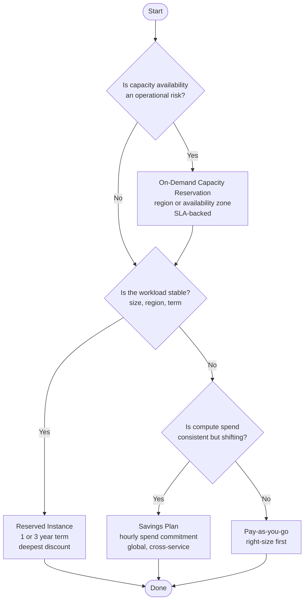

# Capacity Reservations and Reserved Instances Are Not Mutually Exclusive

Reserved Instances and Savings Plans are billing constructs. On-Demand Capacity Reservations are infrastructure constructs. They operate at different layers and stack intentionally. Reserved Instances do not guarantee capacity. Capacity Reservations do not provide a discount on their own. These are separate problems with separate tools, and the value comes from combining them correctly.

---

## Two Layers

**Capacity layer:** On-Demand Capacity Reservations. Specify a VM size, quantity, and location. Azure holds that compute until you delete the reservation. You are billed for capacity whether or not a VM is deployed, but never twice. Unused slots bill at the VM rate; a deployed VM bills as a VM.

**Billing layer:** Reserved Instances commit to a specific VM size and region for one or three years. Deepest discount, least flexibility. Savings Plans commit to a fixed hourly spend across eligible compute services globally. Slightly shallower discount, follows the workload instead of requiring the workload to follow it.

Both stack with Capacity Reservations. The intended pattern: Capacity Reservation for availability assurance, Reserved Instance or Savings Plan to bring the rate down.

---

## When to Use Each

| Question | Tool |
|---|---|
| Will Azure have the capacity when I need it? | Capacity Reservation |
| Best rate for a stable, unchanging workload? | Reserved Instance |
| Reduce cost across a shifting architecture? | Savings Plan |
| Both capacity assurance and cost savings? | Capacity Reservation + Reserved Instance or Savings Plan |

Capacity Reservations belong where capacity failure is an operational risk: DR targets, hard-deadline cutovers, constrained SKUs in specific zones. They are not a cost tool on their own and they consume quota at creation.

Reserved Instances belong on stable, continuously running workloads. Buy to the floor. Unused reserved hours do not roll forward.

Savings Plans belong on consistent compute spend that may shift across VM families, regions, or services. Useful for modernization programs where the architecture is still in motion but the spend level is predictable.

---

## Purchase Decision Flow

---

Right-size before buying anything. Then protect critical capacity. Then cover the stable baseline with Reserved Instances. Then cover flexible residual spend with Savings Plans. Review utilization monthly. A DR plan that leans on Reserved Instances for capacity assurance has a gap. A Capacity Reservation sitting at pay-as-you-go with no matching discount is a cost problem. Both are fixable.
